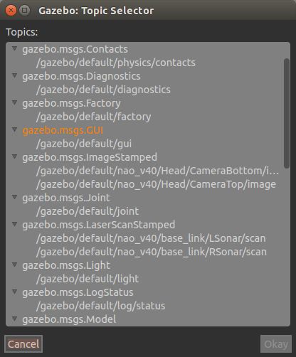
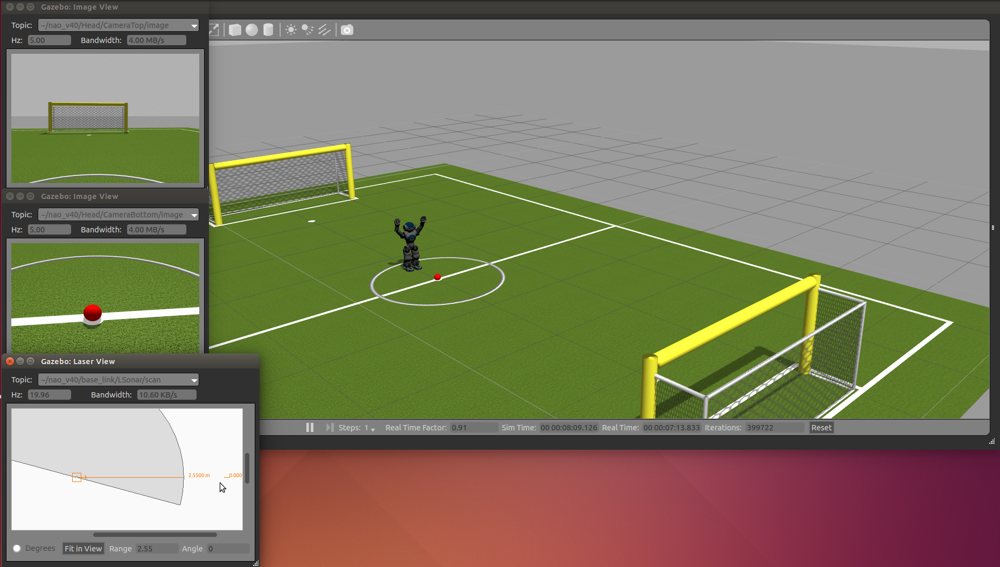
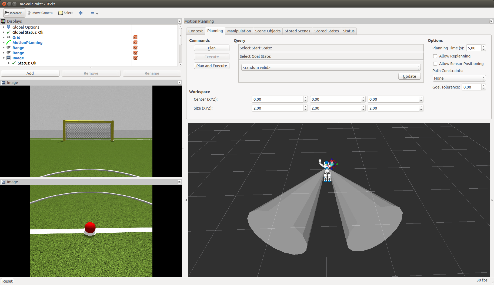

nao_gazebo_plugin
=================

Package developed against ROS Indigo and default gazebo (gazebo 2.2.3)

Installation
------------

These packages require several plugins that you have to compile from source.

Please make sure that the package and all the dependencies are up to date

.. code-block:: bash

    sudo apt-get update

If you haven't done so yet, install the package with apt-get or compile it from source

.. code-block:: bash

    sudo apt-get install ros-indigo-nao-gazebo-plugin

Go to your workspace, clone the packages, and compile them:

.. code-block:: bash

    cd src
    git clone https://github.com/roboticsgroup/roboticsgroup_gazebo_plugins.git
    git clone https://github.com/pal-robotics/pal_msgs.git
    git clone https://github.com/pal-robotics/pal_gazebo_plugins.git
    cd ..
    catkin_make

How to run it
-------------

.. code-block:: bash

    roslaunch nao_gazebo_plugin nao_gazebo_plugin_H25.launch

This will spawn gazebo with nao on a robocup field.
The ball has the same specs as the official RoboCup ball (size and mass).

The simulation will be in pause mode to allow initialization of all the controllers.
Wait until eveything is successfully loaded:

.. code-block:: bash

    [INFO] [WallTime: 1413899465.061789] [0.000000] Controller Spawner: Loaded controllers: /nao_dcm/Head_controller, /nao_dcm/RightArm_controller, /nao_dcm/LeftArm_controller, /nao_dcm/LeftLeg_controller, /nao_dcm/RightLeg_controller, /nao_dcm/RightHand_controller, /nao_dcm/LeftHand_controller, /nao_dcm/joint_state_controller

Click the play button.

Your nao should be standing in front of the ball at the center of the field.

Get sensor data from gazebo
---------------------------

All the sensors are simulated using plugins. These plugins are included in the robot description via naoGazebo.xacro file.
Each sensor publish data on rostopics.

We can visualize topics using Ctrl+T or Window/Topic Visualization

For example, visualizing Cameras and sonar

We can also visualize these messages using Rviz plugins

How to interact with simulated robot
------------------------------------

Using MoveIt!:

To control your simulated robot using MoveIt, run:

.. code-block:: bash

    roslaunch nao_moveit_config moveit_planner.launch

Then you can use moveit as usual : quick tutorial here https://github.com/ros-naoqi/nao_moveit_config/blob/master/tuto/tuto_moveit.rst/#use-moveit

Using Choregraphe behaviours:

To be done
